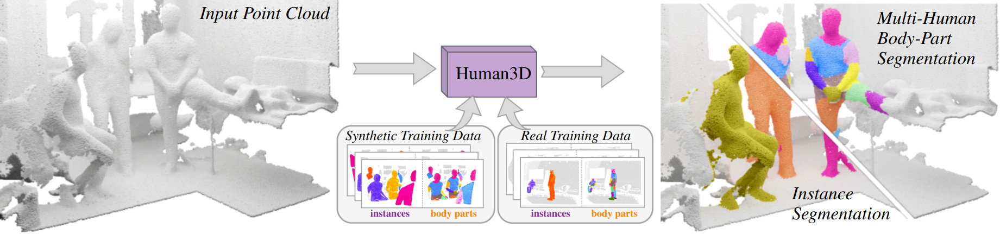

# Human3D 🧑‍🤝‍🧑
## 3D Segmentation of Humans in Point Clouds with Synthetic Data
<div align="center">
<a href="https://aycatakmaz.github.io/">Ay&#231;a Takmaz</a><sup>1,*</sup>,
<a href="https://jonasschult.github.io/">Jonas Schult</a><sup>2,*</sup>,
<a href="https://ikaftan.github.io/">Irem Kaftan</a><sup>1,†</sup>,
<a href="https://cmakcay.github.io/">Cafer Mertcan Ak&#231;ay</a><sup>1,†</sup>,
<a href="https://www.vision.rwth-aachen.de/person/1/">Bastian Leibe</a><sup>1</sup>,
<a href="https://people.inf.ethz.ch/~sumnerb/">Robert Sumner</a><sup>1</sup>,
<br />
<a href="https://francisengelmann.github.io/">Francis Engelmann</a><sup>1</sup>,
<a href="https://inf.ethz.ch/people/person-detail.MjYyNzgw.TGlzdC8zMDQsLTg3NDc3NjI0MQ==.html">Siyu Tang</a><sup>1</sup>

<sup>1</sup>ETH Zurich
<sup>2</sup>RWTH Aachen University
<sup>*,†</sup>equal contribution

We propose the first multi-human body-part segmentation model, called Human3D 🧑‍🤝‍🧑, that directly operates on 3D scenes. In an extensive analysis, we validate the benefits of training on synthetic data on multiple baselines and tasks. 

<a href="https://pytorch.org/get-started/locally/"></a>
<a href="https://pytorchlightning.ai/"></a>
<a href="https://hydra.cc/"></a>
<a href="https://github.com/psf/black"></a>



</div>
<br><br>

[[`Project Webpage`](https://human-3d.github.io/)]    [[`Paper`](https://human-3d.github.io/assets/Human3D_paper.pdf)]


## Code structure
We adapt the codebase of [Mix3D](https://github.com/kumuji/mix3d) and [Mask3D](https://github.com/kumuji/mix3d) which provides a highly modularized framework for 3D scene understanding tasks based on the MinkowskiEngine.

```
├── mix3d
│   ├── main_instance_segmentation.py <- the main file
│   ├── conf                          <- hydra configuration files
│   ├── datasets
│   │   ├── preprocessing             <- folder with preprocessing scripts
│   │   ├── semseg.py                 <- indoor dataset
│   │   └── utils.py        
│   ├── models                        <- Human3D modules
│   ├── trainer
│   │   ├── __init__.py
│   │   └── trainer.py                <- train loop
│   └── utils
├── data
│   ├── processed                     <- folder for preprocessed datasets
│   └── raw                           <- folder for raw datasets
├── scripts                           <- train scripts
├── docs
├── README.md
└── saved                             <- folder that stores models and logs
```


### Dependencies :memo:
The main dependencies of the project are the following:
```yaml
python: 3.10.9
cuda: 11.3
```
You can set up a conda environment as follows
```
# Some users experienced issues on Ubuntu with an AMD CPU
# Install libopenblas-dev (issue #115, thanks WindWing)
# sudo apt-get install libopenblas-dev

export TORCH_CUDA_ARCH_LIST="6.0 6.1 6.2 7.0 7.2 7.5 8.0 8.6"

conda env create -f environment.yml

conda activate human3d_cuda113

pip3 install torch==1.12.1+cu113 torchvision==0.13.1+cu113 --extra-index-url https://download.pytorch.org/whl/cu113
pip3 install torch-scatter -f https://data.pyg.org/whl/torch-1.12.1+cu113.html
pip3 install 'git+https://github.com/facebookresearch/detectron2.git@710e7795d0eeadf9def0e7ef957eea13532e34cf' --no-deps

cd third_party

git clone --recursive "https://github.com/NVIDIA/MinkowskiEngine"
cd MinkowskiEngine
git checkout 02fc608bea4c0549b0a7b00ca1bf15dee4a0b228
python setup.py install --force_cuda --blas=openblas

cd ../../pointnet2
python setup.py install

cd ../../
pip3 install pytorch-lightning==1.7.2
```


### Data preprocessing :hammer:
After installing the dependencies, we preprocess the datasets.
Please refer to [the instructions](https://human-3d.github.io/dataset/) to obtain the synthetic dataset and the dataset based on Egobody.
Put the datasets in `data/raw/`.

#### EgoBody

```
python datasets/preprocessing/humanseg_preprocessing.py preprocess \
--data_dir="../../data/raw/egobody" \
--save_dir="../../data/processed/egobody" \
--dataset="egobody"
```

#### Synthetic Data

```
python datasets/preprocessing/humanseg_preprocessing.py preprocess \
--data_dir="../../data/raw/synthetic_humans" \
--save_dir="../../data/processed/synthetic_humans" \
--dataset="synthetic_humans" \
--min_points=20000 \
--min_instances=1
```

### Training and testing :train2:
Training and evaluation scripts are located in the `scripts/` folder.

## Trained checkpoints :floppy_disk:
We provide detailed scores and network configurations with trained checkpoints.
We pre-trained with synthetic data and fine-tuned on EgoBody.
Both checkpoints can be conveniently downloaded into the `checkpoint/` folder with `./download_checkpoints.sh`.

| Method | Task | Config | Checkpoint :floppy_disk: | Visualizations :telescope:
|:-:|:-:|:-:|:-:|:-:|
| Mask3D | Human Instance | [config](scripts/eval/eval_mask3d.sh) | [checkpoint](https://omnomnom.vision.rwth-aachen.de/data/human3d/checkpoints/mask3d.ckpt) | [visualizations](https://omnomnom.vision.rwth-aachen.de/data/human3d/visualizations/egobody/human_instance/)
| Human3D | MHBPS | [config](scripts/eval/eval_human3d.sh) | [checkpoint](https://omnomnom.vision.rwth-aachen.de/data/human3d/checkpoints/human3d.ckpt) | [visualizations](https://omnomnom.vision.rwth-aachen.de/data/human3d/visualizations/egobody/mhbps/)

Tip: Setting `data.save_visualizations=true` saves the MHBPS predictions using [PyViz3D](https://github.com/francisengelmann/PyViz3D).


## BibTeX :pray:
```
@inproceedings{takmaz23iccv,
    title     = {{3D Segmentation of Humans in Point Clouds with Synthetic Data}},
    author    = {Takmaz, Ay\c{c}a and Schult, Jonas and Kaftan, Irem and Ak\c{c}ay, Mertcan 
                  and Leibe, Bastian and Sumner, Robert and Engelmann, Francis and Tang, Siyu},
    booktitle = {{International Conference on Computer Vision}},
    year      = {2023}
  }
```

# 🗣️ Acknowledgements

This repository is based on the [Mix3D](https://github.com/kumuji/mix3d) and [Mask3D](https://github.com/JonasSchult/Mask3D) code base.
Mask Transformer implementations largely follow [Mask2Former](https://github.com/facebookresearch/Mask2Former).